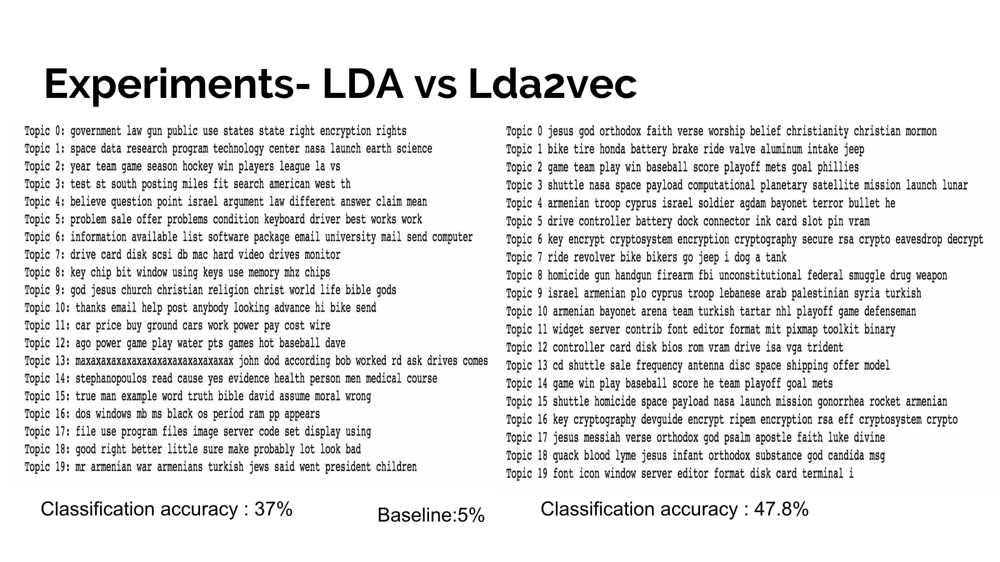
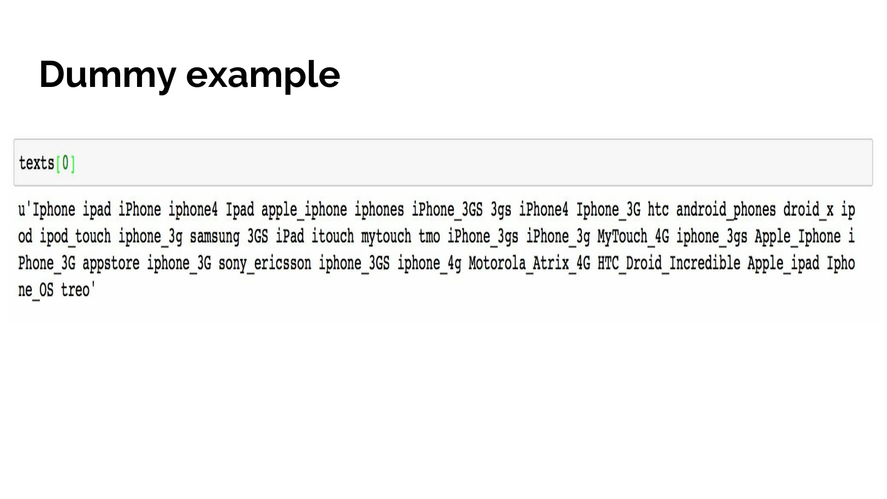
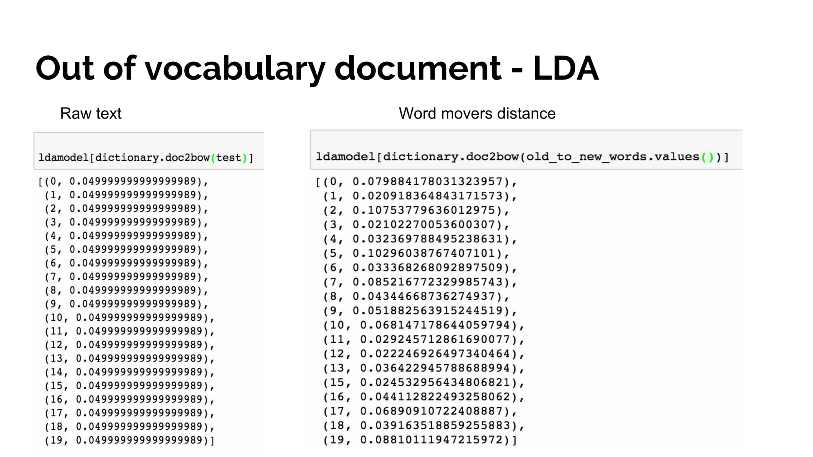
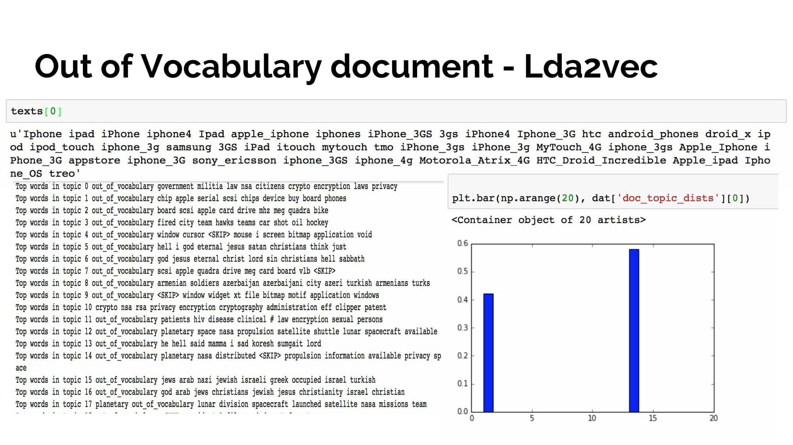

# lda2vec-featurizer

### Uses Chris Moody's Lda2vec algorithm, in attempt to infer topic distribution of test documents containing words that are out of the training vocabulary.

Extracting features out of a corpus of documents is an important task in classification and/or clustering of documents. This paper discusses how lda2vec can be used in feature extraction, especially for new documents containing words that are mostly out of the training vocabulary. Latent Dirichlet Allocation (LDA) mining thematic structure of documents plays an important role in nature language processing and machine learning areas. However, LDA or a simple TF-IDF representation would not be able to handle documents containing out of vocabulary words. Lda2vec learns dense word vectors jointly with Dirichlet-distributed latent document-level mixtures of topic vectors. By using pre- trained word vectors and the learned topic vectors specific to the training corpus, a new document can be featurized by only updating the topic distribution. In doing so, we can build document representations, which are more expressive than some widely-used latent topic models.

Lda2vec and Word Mover’s Distance with LDA can be used to featurize the documents that are completely filled with words that the training model has not seen before. In lda2vec, Word, topic, and document vectors are jointly trained and embedded in a common representation space that preserves semantic regularities between the learned word vectors. The implementation of the Lda2vec is not optimal for inferring topic distributions for test documents of this kind. This can be improved to implement in a much optimized way to update the topic distribution without having to pass in the training vocabulary for the model to remember the word vector space of the training corpus.
